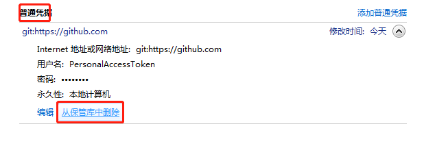
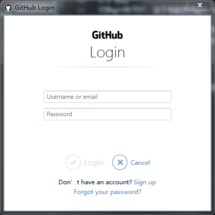

# A1.1 提交失败

## 1.git push 报错403(Windows平台)
### 1.1 现象

```bash
$ git push origin master
remote: Permission to jiuchou/handbook.git denied to Gtry.
fatal: unable to access 'https://github.com/jiuchou/handbook.git/': The requested URL returned error: 403
```
### 1.2 原因
切换git账号时，由于电脑使用git bash配过SSH，系统已经将指向github.com的用户设置为老用户，每次push操作的时候，默认读取保存在本地的老用户。
### 1.3 解决方案
Windows通过凭据管理器删除之前的老用户的认证信息，如下图所示：

执行提交命令

```bash
$ git push origin master
```
重新提交的时候，git会要求你输入新的用户名和密码，输入后就可以成功提交了。


