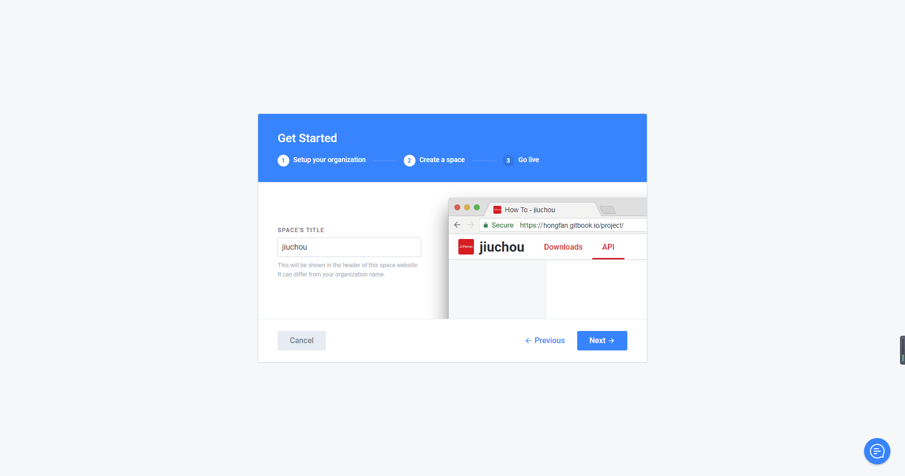
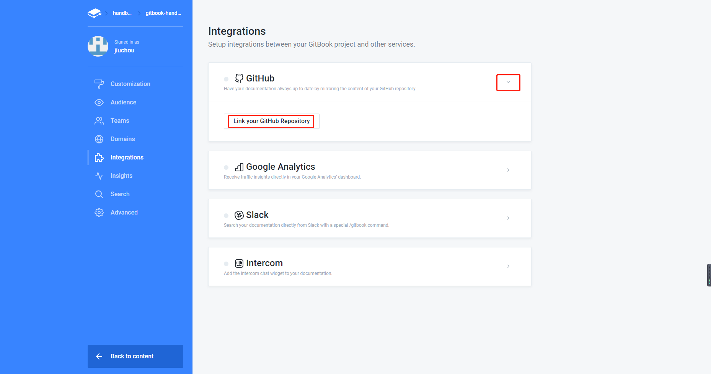
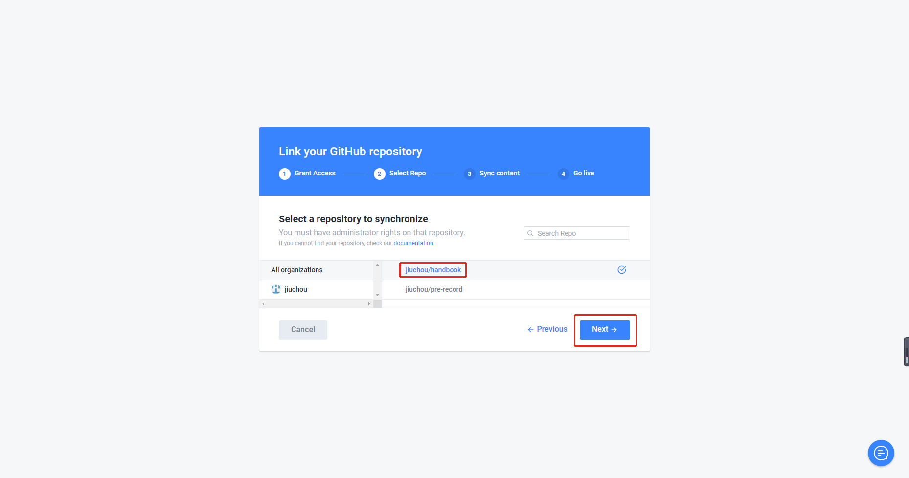
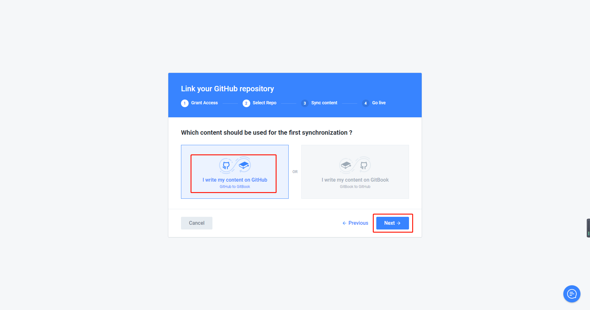

# 2.4.发布到 [Gitbook.com](http://gitbook.com/)

* 参考

  * [用 GitHub + GitBook 发布一本新书](https://www.jianshu.com/p/f2cc70a73a90)(推荐)

* 前提

  * GitHub账号

  * 已经存在使用GitBook编辑好的书籍

## 说明

[Gitbook.com](https://gitbook.com/) 是一个发布 gitbook 编写书籍的在线网站，提供公开和私有的托管服务，和 GitHub 一样，私有的 Gitbook 是需要付费使用的。但是公开的书籍是无上限的，使用在线的 Gitbook 可以让未接触过 Git 和 Markdown 的作者轻松的创建书籍，并且在线的编辑器可以让作者安心的只关心内容，而不必在意排版，并且支持多人协作编写。

在 Gitbook 上建立账户，新建项目之后，其实也是一个 Git 项目，如果对 Git 熟悉，将本地内容推送到远端即可。

* 优势：
  * 简单、易用
* 劣势：
  * 国内访问速度较慢

## 1.登录GitBook，选择用GitHub账号登录

网址：[www.gitbook.com](http://www.gitbook.com/)

## 2.创建organization和space

## 3.关联GitHub仓库到GitBook

