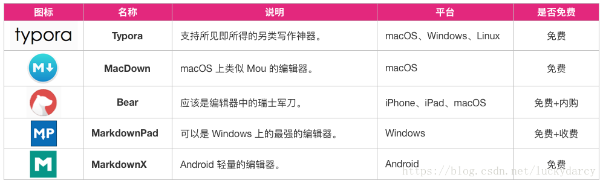

# 3.1.Markdown编辑器

合适的 Markdown 编辑工具可以提升我们的写作速度，同时带来良好的写作体验，

市面上我们可以找到很多 Markdown 编辑器，比如 Typora、MacDown、Bear、MarkdownPad、MarkdownX、JetBrains’s IDE（需要安装插件）、Atom、简书、CSDN 以及 GitBook 自家的 GitBook Editor 等等。

