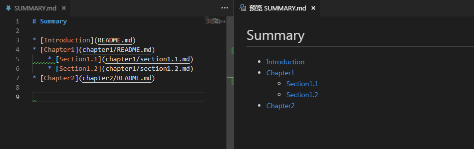

# 3.1.1.Typora

- 下载地址：https://typora.io/#windows
- 参考
  - [让 Markdown 写作更简单，免费极简编辑器：Typora](https://sspai.com/post/30292)

Typora 是所见即所得（实时渲染）的 Markdown 编辑器。

市面上现在比较流行的 Markdown 编辑器，都基本采用了「写字」和「预览」相分离的策略，无论是像 Mou 将窗口左右排列，还是像 Typed 一样两种状态需要切换显示，都似乎离 Markdown 的初衷渐行渐远：优雅可控的格式是为了让文字本身更易读。

然而，在实际使用的时候，由于文字的输入源和文字的输出源是割裂的，这件事情本身就显得不纯粹，再加上众多 Markdown 编辑器始终没有着手解决表格、代码等格式的编辑，也使 Markdown 变得不那么优雅。

比如Visual Studio Code使用 Markdown 插件(Markdown All in One)的展示效果：

Typora 与其他比较流行的 Markdown 编辑器相比，有一个比较大的区别，在于针对编辑与预览的处理方式。

Typora将「编辑」和「预览」这两件事情合并了，你输入的地方，也是输出的地方，即现在很流行的 WYSIWYG（What You See Is What You Get）。其实转念一想，这不就是回到了 Office Word 嘛，只不过编辑文本时不用再去工具栏上点选，一切的格式都能通过符号来控制。

## 延伸
[Typora - 颠覆写作体验的免费极简 Markdown 编辑器！好用的 MD 格式阅读器](https://www.iplaysoft.com/typora.html)

